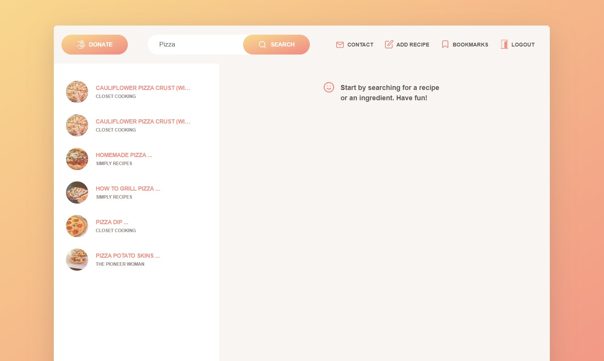

# Eatary

        
## Table of Content
* [Description](#description)
* [Installation](#installation)
* [Usage](#usage)
* [Credits](#credits)
* [License](#license)
* [Features](#features)
* [Tests](#tests)
* [GitHub](#github)
* [Contact](#contact)

## Description
Here at Eatary it is our mission to bring thousands of recipes to you at the touch of your fingertips. We have created a simple and elegant site so you can get some of your favourite recipes with just a touch of a button. Simply sign up, start searching and add some of your favourite recipes to your bookmarks! For our more creative and innovative chefs you can add YOUR recipes for millions to try! When you search with our site you are supporting local creators from website to recipes let Eatary be your choice!

## Installation
Clone the repo here, run "npm install if no packages are installed",run "npm run build" and finally run "npm run develop"

https://github.com/jarrettbutler/Eatary

or watch the video here:

https://drive.google.com/file/d/1WFAVmmCox3s4VxBWv9AwnRnSnEfULtpx/view

or visit the deployed site here

https://eatary.herokuapp.com/

## Usage
Sign up an account to use Eatary. Once on the dashboard search for your desired food. It will appear on the dashboard and you can bookmark it using the button found on the recipe. It will then be accessible in your bookmarks tab at the top of the screen. You can also use the add recipe tab to create a recipe of you own. Fill in the required fields and the recipe will save to the database and be available for all users to search.

## Credits
Rufat Eskendarov
https://github.com/RufatEskendarov

Feliks Borshchevskyi
https://github.com/felixbor

Zaira Barakaeva
https://github.com/ZairaBarry

## License
https://opensource.org/licenses/MIT
Please see repo for more information on license

## Features
Search Recipes
Add recipes to bookmarks
Donate
Contact Us
Add recipes

## Tests
Run the installation instructions and watch the magic happen

## Github
https://github.com/jarrettbutler/Eatary

## Contact
Jarrett Butler

jbutler98@hotmail.com

https://github.com/jarrettbutler
